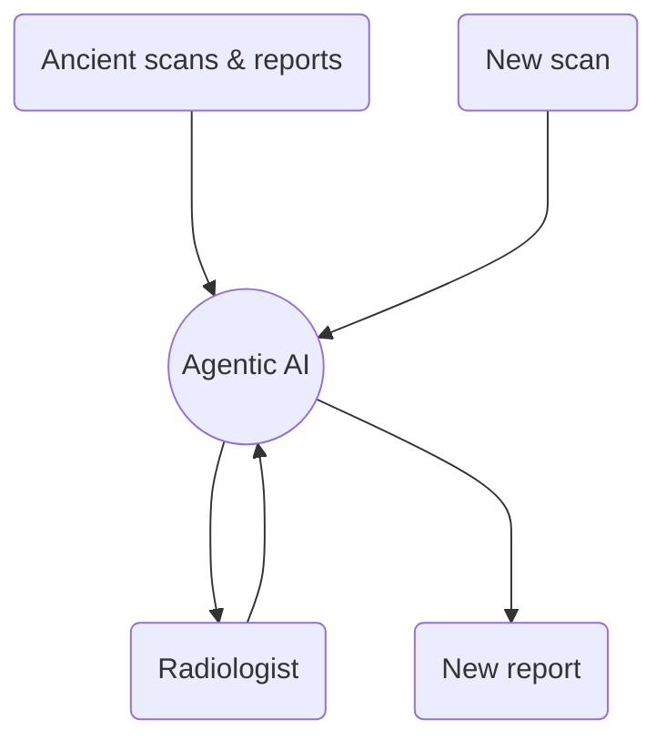

# General idea




# UNBOXED – Medical AI Agentic: Radiology Copilot (Hackathon MVP)

MVP built during the **UNBOXED Medical AI Agentic** hackathon (Lyon x Paris).  
This project is a **demo prototype** that generates structured radiology-style outputs from segmentation-derived metrics and text context.

## Features
- Chatbot powered by **Mistral API**
- **3D tumor visualization** (mesh from segmentation, OBJ export)
- **Structured report generation** (clinician-facing output + optional patient-friendly summary)

## Architecture (high level)
Retrieve (RAG) → Measure (SEG metrics) → Locate (centroid) → Draft (report)

## Repository structure
- `RAG/` : RAG + coordinator + prompts (+ optional voice utilities)
- `construct_mesh.py` : marching cubes → OBJ mesh export
- `util_dicom.py` : DICOM loading helpers
- `web_interface.py` : demo web interface / entrypoint
- `docs/` : diagrams / notes

## Run locally

### Requirements
- Python 3.10+ recommended

### Install
```bash
pip install -r RAG/requirements.txt
pip install scikit-image
